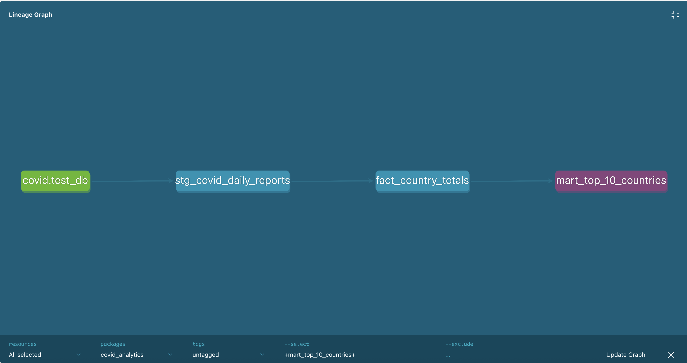
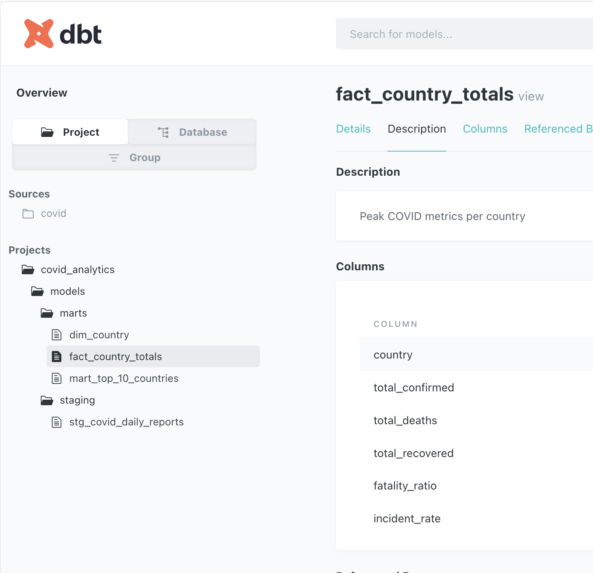
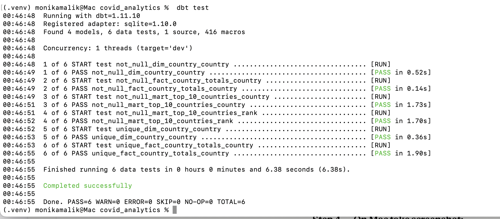

# COVID-19 Analytics — dbt Layer

Analytics engineering layer built on top of the 
COVID-19 ETL pipeline — transforming 3.7 million rows 
of raw data into a clean, tested, and documented 
star schema using dbt.

## Architecture

Raw SQLite (3.7M rows)
        ↓
stg_covid_daily_reports   ← staging: clean + standardize
        ↓
fact_country_totals        ← fact: peak metrics per country
dim_country                ← dimension: unique countries
        ↓
mart_top_10_countries      ← mart: ranked analytics

## dbt Lineage Graph


*Auto-generated lineage showing model dependencies*

## dbt Data Catalog


*Auto-generated documentation for all models*

## Test Results


*6 of 6 data quality tests passing*

## What this project does

- Transforms raw COVID-19 data following 
  Kimball star schema methodology
- Implements staging → fact → dimension → mart layers
- Runs 6 automated data quality tests on every run
- Auto-generates a data catalog with dbt docs

## Models

| Model | Layer | Description |
|---|---|---|
| stg_covid_daily_reports | Staging | Cleans raw data, standardizes columns, casts types |
| fact_country_totals | Fact | Peak confirmed, deaths, fatality ratio per country |
| dim_country | Dimension | Unique country list — star schema dimension |
| mart_top_10_countries | Mart | Top 10 countries ranked by confirmed cases |

## Data Quality Tests

| Test | Model | Column | Result |
|---|---|---|---|
| not_null | fact_country_totals | country | ✅ PASS |
| unique | fact_country_totals | country | ✅ PASS |
| not_null | dim_country | country | ✅ PASS |
| unique | dim_country | country | ✅ PASS |
| not_null | mart_top_10_countries | country | ✅ PASS |
| not_null | mart_top_10_countries | rank | ✅ PASS |

## Results — Top 10 Most Affected Countries

| Rank | Country | Confirmed Cases | Deaths |
|---|---|---|---|
| 1 | France | 38,618,509 | 161,512 |
| 2 | Korea, South | 30,615,522 | 34,093 |
| 3 | United Kingdom | 20,656,177 | 186,138 |
| 4 | Turkey | 17,042,722 | 101,492 |
| 5 | Vietnam | 11,526,994 | 43,186 |
| 6 | Argentina | 10,044,957 | 130,472 |
| 7 | Taiwan | 9,970,937 | 17,672 |
| 8 | India | 8,138,129 | 148,424 |
| 9 | Germany | 8,048,396 | 31,400 |
| 10 | Iran | 7,572,311 | 144,933 |

## DE Concepts Demonstrated

- **Kimball star schema** — fact + dimension modeling
- **dbt staging layer** — single source of truth for raw data
- **dbt ref()** — model dependency management
- **Window functions** — DENSE_RANK for ranking
- **CTEs** — clean query structure in mart layer
- **Data quality as code** — automated tests in schema.yml
- **dbt docs** — auto-generated data catalog

## How to Run

```bash
# Install dependencies
pip install dbt-core dbt-sqlite

# Run all models
dbt run

# Run data quality tests
dbt test

# Generate and view documentation
dbt docs generate
dbt docs serve
```

## What I Learned

- dbt enforces separation of concerns —
  staging cleans, facts aggregate, marts answer questions
- Data quality tests belong in the pipeline —
  not as an afterthought
- Kimball modeling starts with business questions,
  not technical schema design
- dbt ref() creates implicit dependencies —
  dbt figures out the run order automatically

## What I Would Do Differently at Scale

- Use **Snowflake or BigQuery** instead of SQLite
  for petabyte-scale analytics
- Add **incremental models** — only process
  new records on each run instead of full refresh
- Add **dbt snapshots** for SCD Type 2 —
  tracking how country metrics change over time
- Add **Airflow** to orchestrate dbt runs
  on a daily schedule with alerting
- Add **Great Expectations** or custom data quality
  framework for more sophisticated anomaly detection

## Source Data

Johns Hopkins University COVID-19 Dataset
- 1,200+ daily report CSV files
- January 2020 — March 2023
- 200+ countries
- 3,709,419 rows total